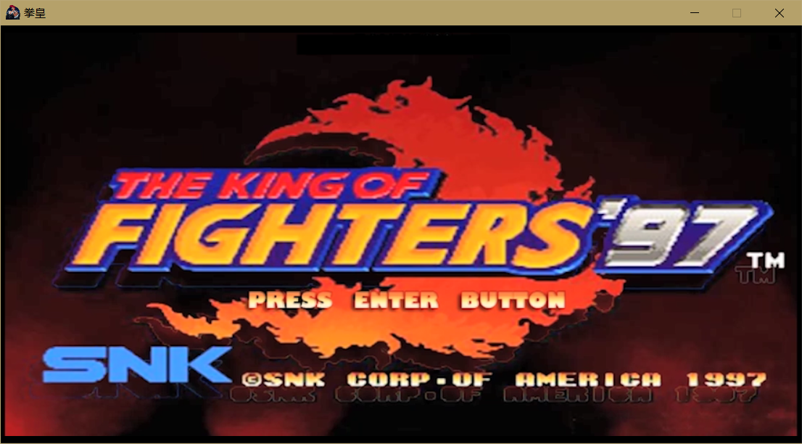
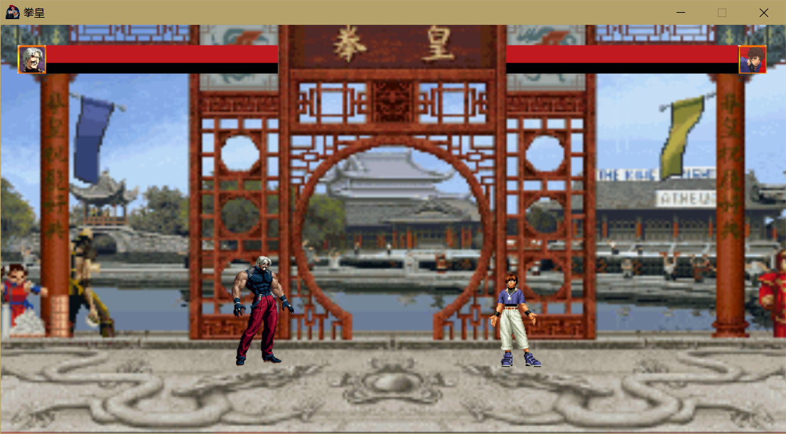
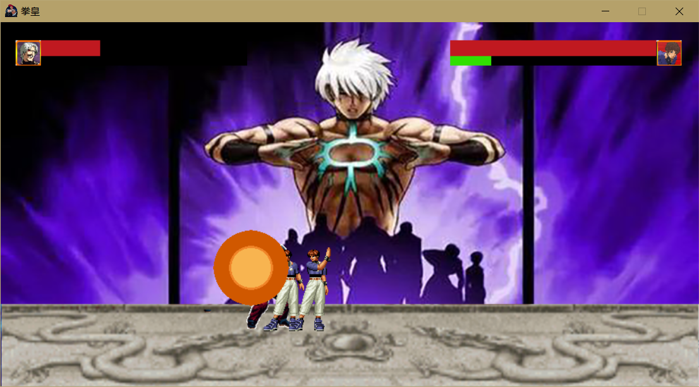

# KingOfFighters C#
使用Winform实现简易版拳皇

本游戏使用VS2008制作，本想实现一下经典游戏拳皇，但使用Winform来制作复杂的游戏实在有些勉强，在完成了攻击、判定、能量、技能等基本功能后，开始尝试使用Unity，便没有再更新该项目。

可以通过点击TheKingOfFighters\TheKingOfFighters\bin\Debug目录下的TheKingOfFighters.exe直接试玩。

游戏截图如下：

main：

fight:

skill：

